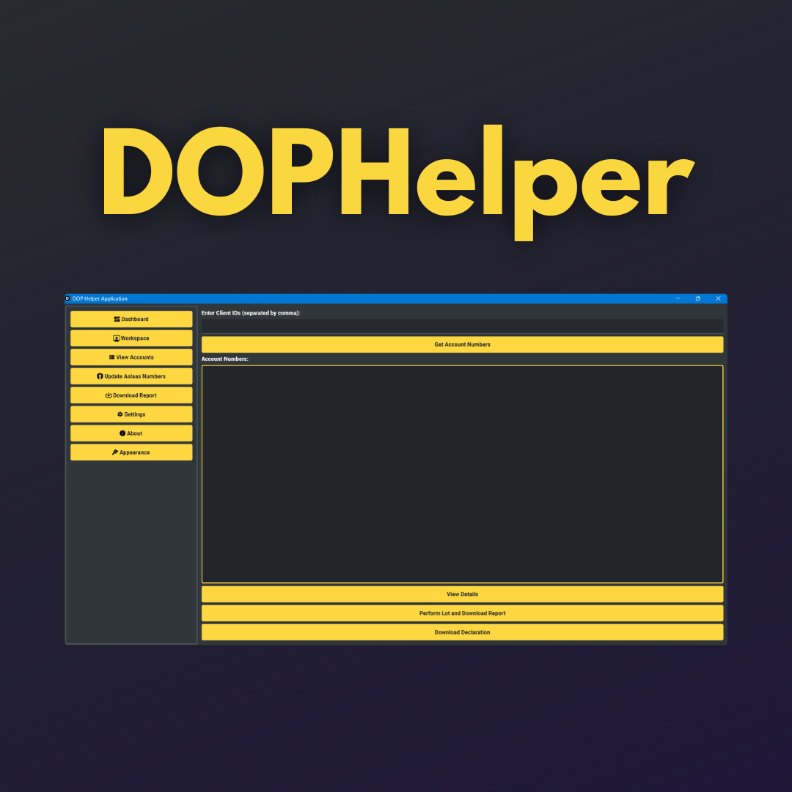

# DOPHelper Application
This is an python based GUI app for India Post MPKBY agents. This app allows Post agents to perform RD Lists in one click. This app is based on python pyqt5 and selenium webdriver to automate the process.


## Introduction
DOPHelper is a PyQt5-based GUI application designed to assist MPKBY (Monthly Public Key-based Investment Scheme) agents in automating various tasks related to lot creation process. The application requires Firefox preinstalled on your PC as it utilizes Selenium WebDriver for web automation. Additionally, it integrates OCRSpace API for captcha prediction.

## Features
- Automates lot creation process for MPKBY agents.
- Streamlines login process to the designated portal.
- Utilizes Selenium WebDriver for web automation.
- Uses OCRSpace API for captcha prediction.
- Provides functionality for lot/list and download report.
- Creates declaration and requirements.txt for easy setup.
- Organized into main GUI file (`DOPHelper.py`) and three helper Python files (`dopwebassistant.py`, `dopfileassistant.py`, `dopdatabaseassistant.py`).
- Contains a folder named `_internal` which includes the `static` folder with other required files.

## Prerequisites
Before using DOPHelper, ensure you have the following installed:
- Python
- PyQt5
- Firefox browser
- Selenium WebDriver
- OCRSpace API credentials

## Installation
1. Clone the repository or download the source code.
2. Install the required dependencies using pip:
   ```bash
   pip install -r requirements.txt
   ```
3. Ensure Firefox is installed on your system.
4. Obtain OCRSpace API credentials and replace them in the appropriate place within the code.

## Usage
1. Run the main GUI file `DOPHelper.py`.
2. The application interface will appear, guiding you through various tasks.
3. Follow the instructions provided on the GUI to automate the desired processes.
4. Ensure you have a stable internet connection for seamless automation.
5. Report any issues or bugs encountered during usage to the developer.

## Directory Structure
```bash
DOPHelper/
│
├── DOPHelper.py        # Main GUI file
├── dopwebassistant.py  # Web automation helper
├── dopfileassistant.py # File management helper
├── dopdatabaseassistant.py # Database management helper
│
├── requirements.txt    # Dependencies
│
└── _internal/          # Internal resources
    ├── static/         # Static files
    │   ├── (other required files)
    │   └── ...
    └── ...
```

## Support
For any inquiries, suggestions, or issues, feel free to contact the developer.

## License
This project is licensed under the [MIT License](LICENSE).
